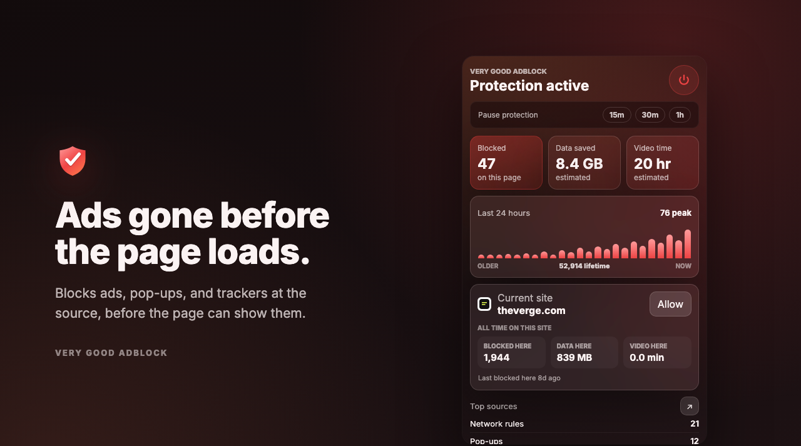
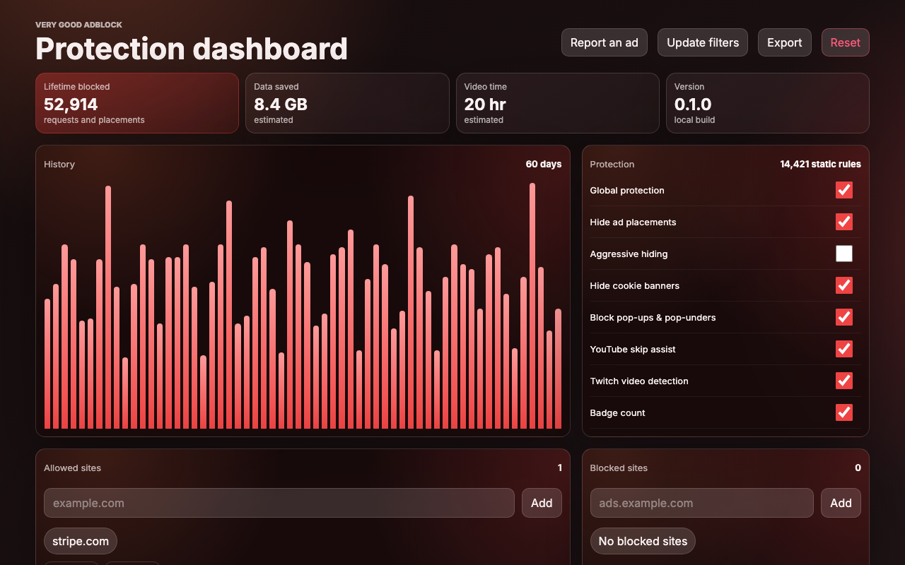

# Very Good AdBlock

A fast, open-source Manifest V3 ad blocker for Chrome, Firefox, and Safari. It removes ads, pop-ups, and YouTube and Twitch interruptions **at the source**, then stays out of the way. No account, no telemetry, no bloat.

[](./LICENSE) [](https://bun.sh) [](https://developer.chrome.com/docs/extensions/mv3/intro/)

<p align="center">
  
</p>

## Install

Use the official store for automatic updates, or download the verified packages from the latest GitHub Release:

- [Chrome Web Store](https://chromewebstore.google.com/detail/very-good-adblock/ondclgjpkclbchfbbjdikdpdnopbachc) for Chrome, Edge, Brave, Arc, and other Chromium browsers.
- [Firefox Add-ons](https://addons.mozilla.org/firefox/addon/very-good-adblock/) for desktop Firefox 142 and newer.
- [Apple App Store](https://apps.apple.com/app/id6792576349) for Safari on Mac, iPhone, and iPad. The listing is in App Review and this permanent link becomes installable when Apple approves it.
- [Latest GitHub Release](https://github.com/chrisbbreuer/very-good-adblock/releases/latest) for versioned Chrome, Firefox, and Safari packages plus SHA-256 checksums.

Safari users launch the app once, then enable the extension in **Settings > Apps > Safari > Extensions** on iPhone or iPad, or **Safari > Settings > Extensions** on Mac.

## Features

- Cross-browser Manifest V3 build (Chrome, Firefox, and Safari) from one codebase, with per-target manifests generated at build time.
- MV3 `declarativeNetRequest` blocking with bundled static rules (14,000+) plus dynamic local rules for per-site allowlisting.
- Pinned generated host rules from EasyList and AdGuard filter-list revisions, refreshed daily as dynamic rules between releases.
- YouTube ad removal at the source (player/browse/Shorts responses), skip assist, non-skippable fast-forward, and anti-adblock pop-up dismissal.
- X promoted-tweet removal at the source, and Twitch video-ad marker detection for saved-time stats.
- Pop-up and pop-under defusing, plus opt-in cookie-consent hiding.
- Local-first stats for blocked ads, estimated data saved, and estimated video time saved, with compact Chrome cloud sync for fresh installs.
- One-click reporting: if an ad slips through, the popup files a fully pre-filled GitHub issue with diagnostics and a page screenshot attached.
- Premium, minimal STX popup and dashboard UI, with external scripts for MV3 CSP safety.

<p align="center">
  
</p>

## Why

Very Good AdBlock exists because waiting for an ad to interrupt you before it gets blocked is backwards. Pop-ups, intrusive placements, and video ads should be gone *before* the page can show them, with a blocker that stays fast, small, and modern instead of shipping a background page that churns on every request.

## Performance

Speed here is an architecture decision, not a micro-optimization pass:

- **Network blocking runs in the browser, not in JavaScript.** MV3 `declarativeNetRequest` hands the rules to the browser's native network stack (C++), so ad and tracker requests are matched and cancelled with **zero per-request JavaScript**. There is no background page waking up to inspect every request the way an MV2 `webRequest` blocker does. This is the lowest-overhead blocking model a modern extension can use.
- **Ads are pruned once, at the source.** For YouTube and X, the ad instructions are deleted from the JSON response before the page ever schedules or renders them — a single pass over the payload, no polling, no `MutationObserver` hammering the DOM waiting for an ad to appear.
- **The content script stays cheap.** Cosmetic hiding uses a small, site-specific selector set behind throttled observers; the player region is never touched.
- **Nothing phones home.** No analytics, no telemetry, no remote config fetches on the hot path — the only network call the extension makes is the filter-list refresh (scheduled daily, plus once on install/startup).

### Benchmarks

`bun run bench` measures the actual runtime hot paths on representative fixtures. Numbers below are from Bun 1.3 on an Apple Silicon laptop (run it yourself for your machine):

| Operation | What runs while you browse | Time | Throughput |
|---|---|---:|---:|
| `pruneYouTubeAds` | parse + strip ads from a 90 KB YouTube browse response | ~0.39 ms | ~2,500/s |
| `prunePromotedFromTimeline` | parse + strip promoted tweets from a 34 KB X timeline | ~0.13 ms | ~7,400/s |
| `activeCosmeticGroups` | resolve the cosmetic selectors for a page | ~95 ns | ~10.5M/s |
| `eventTotals` | aggregate 240 block events for the dashboard | ~0.84 µs | ~1.2M/s |
| `siteMatches` | match a hostname against your allowlist | ~130 ns | ~7.8M/s |
| `buildStaticRules` | compile the 14,421-rule static ruleset | ~0.35 ms | — |
| `buildHostRefreshRules` | compile 15,000 filter hosts into DNR rules | ~1.8 ms | — |

The takeaway: every response the extension touches is cleaned in a fraction of a millisecond, and the per-page work (cosmetic resolution, allowlist checks) is measured in nanoseconds. The network blocking itself costs no JavaScript at all.

### Native DNR vs. the JavaScript matching-engine model

This is a comparison of **blocking models, not products**. There are two ways an ad blocker can decide whether to block a request, and they cost very differently:

- **The JavaScript matching-engine model.** The blocker keeps the parsed filter list in memory and runs a JavaScript `match()` on every request. This is what `@gorhill/ubo-core`, `adblockpluscore`'s `Matcher`, and `@ghostery/adblocker` implement — and it's still what ships today wherever the browser doesn't offer a native path, most notably **uBlock Origin on Firefox**, which keeps the blocking `webRequest` API.
- **The native declarativeNetRequest model.** The blocker registers its rules with the browser and the browser's own network stack does the matching — **zero per-request JavaScript**. This is what Very Good AdBlock does, and what Chrome's Manifest V3 mandates.

The benchmark measures the **per-request cost of each model**. It is *not* a claim that any competitor's product is slow: every one of these projects also has a native build — **uBO Lite**, **ABP MV3** (its `adblockpluscore` ships a `lib/dnr/` rule generator), and **Ghostery MV3** all use `declarativeNetRequest`, and **Brave** builds [adblock-rust](https://github.com/brave/adblock-rust) into the browser core because it *is* the browser. Where any of them runs natively, its per-request JavaScript cost collapses to ~0 too — exactly like ours. What the table shows is the tax the JavaScript model pays that the native model simply doesn't.

The same `bun run bench` runs the comparison. Every engine is fed the **exact filter lists this extension pins** (EasyList + AdGuard, ~54k lines) and the same 12,000-request corpus; all four agree on ~4,795 blocks, so it's the same job measured four ways.

**Per-request matching cost** — the JavaScript spent per request under each model. Under native DNR this runs in the browser, not the extension:

| Model / engine | JS per request | Throughput |
|---|---:|---:|
| JS engine — Adblock Plus (`adblockpluscore`) | ~2.4 µs | ~410K/s |
| JS engine — Ghostery (`@ghostery/adblocker`) | ~3.4 µs | ~300K/s |
| JS engine — uBlock Origin (`@gorhill/ubo-core`) | ~0.83 µs | ~1.2M/s |
| **Native DNR — Very Good AdBlock** | **0 (in browser)** | **native** |
| └ *JS host-set reference (if we matched in JS)* | *~0.64 µs* | *~1.6M/s* |

Under the native model the matching happens in the browser's own network stack, so no extension JavaScript runs on the request hot path — the same holds for uBO Lite, ABP MV3, and Ghostery MV3 when they run natively. The italic reference row shows what our host set *would* cost if we matched it in JavaScript instead; it never runs in production.

**List ingest (one-time, at startup)** — turning filter lists into a ready-to-block state:

| Model / engine | Ingest time | What it builds |
|---|---:|---|
| JS engine — Adblock Plus | ~48 ms | in-memory `Matcher` |
| JS engine — Ghostery | ~60 ms | in-memory engine |
| JS engine — uBlock Origin | ~68 ms | in-memory engine |
| **Native DNR — Very Good AdBlock** | **~3 ms** | declarativeNetRequest rules the browser enforces |

These builds are *not* identical work, and the table says so: the JavaScript engines parse the full raw list into in-process match structures, while Very Good AdBlock parses raw lists offline at build time (`bun run update:filters`) and at runtime only compiles the reduced host list into DNR rules. The point isn't that our parser is faster — it's that the expensive matching structure lives in the browser, not in the extension (as it also does for the competitors' native builds).

> **Method & honesty notes.** These are matching-engine microbenchmarks comparing *models*, not a blocking-quality or product comparison. The JavaScript engines support filter syntax (path/regex/type modifiers, exceptions) that our host-based DNR ruleset intentionally reduces to hostname blocking, so this measures *runtime cost of the model*, not coverage. Engines are the real upstream packages fed identical lists; the corpus's blocked requests are drawn from the same lists so every engine has genuine matching work. The filter lists are fetched once into `bench/fixtures/` (git-ignored — they're GPL) and cached. Run `bun run bench --no-compare` for just the hot paths.

## Cosmetic filtering

Cosmetic filtering hides first-party ad placements that survive network blocking (YouTube feed/masthead/display ads, Twitch display banners, X promoted entries). It ships on by default behind site-specific selectors, global and per-site kill switches, a narrow default set with an opt-in aggressive tier, and per-page diagnostics. The player region is never hidden, so skip automation and playback are untouched. See [`docs/architecture/cosmetic-filtering.md`](./docs/architecture/cosmetic-filtering.md).

## Reporting an ad that got through

If an ad, pop-up, or interruption slips past, filing a report takes one click: open the extension popup and press **"Saw an ad slip through?"** (or **Report an ad** on the dashboard). It opens a fully pre-filled GitHub issue and copies a screenshot of the page to your clipboard so you can paste it in.

The report auto-collects the diagnostics needed to fix it — extension version, browser, the page (with query string and fragment stripped so no session tokens leak), protection state, on-page block counts, and filter-source revisions. No browsing history is included. Prefer to file by hand? Use the [🚨 An ad got through](https://github.com/chrisbbreuer/very-good-adblock/issues/new?labels=ad-reached-user&template=ad-reached-user.md) issue template.

## Setup

```bash
bun install
bun run build
```

Load `dist/` as an unpacked extension in Chrome (`chrome://extensions` → Developer mode → Load unpacked).

### Firefox

```bash
bun run build:firefox
```

This emits a Firefox-flavored build (an event-page `background`, `browser_specific_settings.gecko`, and no `minimum_chrome_version`) into `dist-firefox/`. Load it via `about:debugging#/runtime/this-firefox` → **Load Temporary Add-on** → select `dist-firefox/manifest.json`, or run `bun run dev:firefox` to launch it with `web-ext run`.

### Safari

```bash
bun run safari:app
```

This builds the Safari flavor into `dist-safari/` (a `browser.*`-namespace rewrite plus a Safari manifest with `strict_min_version` 18.4), generates the shared macOS/iOS Xcode container, and builds the selected app targets. On iPhone or iPad, enable **Very Good AdBlock** in *Settings > Apps > Safari > Extensions*. On Mac, launch the app once and enable it in *Safari > Settings > Extensions*. Requires Safari 18.4+ and full Xcode; signing and App Store distribution are covered in [`safari/README.md`](./safari/README.md) and [`docs/architecture/safari.md`](./docs/architecture/safari.md).

## Releases

`bun run release:patch`, `release:minor`, and `release:major` create and push the version commit and tag. GitHub Actions then validates all browser packages, publishes Chrome and Firefox, builds and uploads the macOS/iOS Safari app, and creates the GitHub Release with checksums. If Chrome or Apple is already reviewing an earlier version, Stacks records the new version as queued and retries those stores automatically every six hours without republishing Firefox.

## Scripts

```bash
bun run build            # build the Chrome extension into dist/
bun run build:firefox    # build the Firefox extension into dist-firefox/
bun run build:safari     # build the Safari extension into dist-safari/
bun run safari:app       # build + sync + xcodebuild the Safari container app
bun run bench            # hot-path benchmarks + head-to-head vs uBO/ABP/Ghostery
bun run test             # unit tests
bun run smoke:chrome     # headless Bun WebView smoke test
bun run site:build       # build the marketing site + docs into dist/site
bun run package          # validate + zip the extension for the store
bun run update:filters   # regenerate host rules from the filter lists
bun run typecheck        # tsc --noEmit
bun run lint             # pickier
```

## Notes

The UI is authored as `.stx` pages and compiled by `bun-plugin-stx`. Runtime behavior is bundled into external TypeScript modules because Manifest V3 extension pages cannot rely on inline scripts.

Stats are local-first: compact settings, lifetime totals, daily history, and top-site rollups use `chrome.storage.sync` so a new Chrome install can hydrate the dashboard; high-churn hourly/site-detail/recent-event data stays in `chrome.storage.local`.

## License

[MIT](./LICENSE) © Chris Breuer
